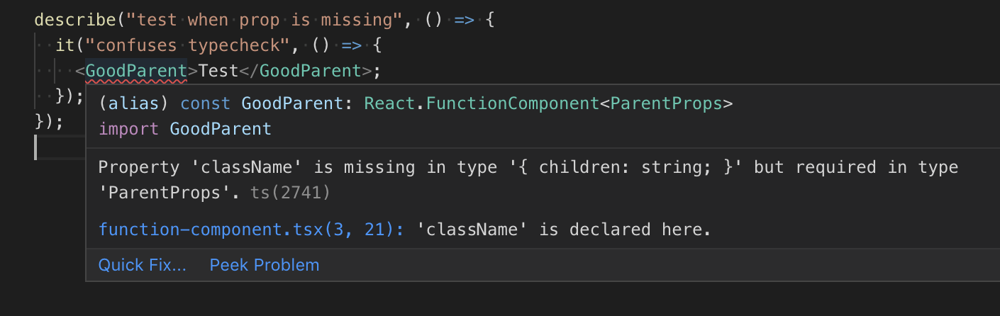

export {default as theme} from './src/theme';
import AboutMe from './src/about-me';
import {Appear, Image, Notes} from 'mdx-deck';
import {CodeSurfer} from 'mdx-deck-code-surfer';
import TallImage from './src/tall-image';
import {TwitterTweetEmbed} from 'react-twitter-embed';
import {AppearList} from './src/appear-list';
import {NotesList} from './src/notes-list';

# TypeScript: Seeing Past The Hype

---

<AboutMe />

---

<TwitterTweetEmbed tweetId="1081778805956476928" />

---

<TwitterTweetEmbed tweetId="1081686244399214595" />

---

<TwitterTweetEmbed tweetId="1085844393549094912" />

---

<TwitterTweetEmbed tweetId="1079296773087285249" />

---

<TwitterTweetEmbed tweetId="1089069531513802755" />

---

  
  
  
  

---

## Google Trend

---

# Today We're Going To Get Past The Hype

<AppearList>
  <li>What is TypeScript?</li>
  <li>What are the wins?</li>
  <li>I'm gonna show you some super cool types.</li>
</AppearList>

---

# Let's take 10 steps back

---

# What is a type?

---

# A type is an attribute of data that tells the computer how the programmer intends to use it.

---

# Basic Types

<AppearList>
  <li>boolean</li>
  <li>number</li>
  <li>string</li>
  <li>array</li>
  <li>object</li>
  <li>enum</li>
</AppearList>

---

# Less Basic Types

<AppearList>
  <li>null</li>
  <li>undefined</li>
  <li>never</li>
  <li>void</li>
</AppearList>

---

# Types can also be derived from other types

<Appear>But we'll come back to that</Appear>

---

# Any

---

# What is TypeScript?

---

# Strict superset of JavaScript

---

<CodeSurfer
  code={require('!raw-loader!./snippets/what-is.ts').default}
  lang="typescript"
  showNumbers={true}
  dark={true}
  steps={[{}, {tokens: {1: [2, 3, 4, 5], 2: [3, 4, 5], 4: [6, 7, 8]}}]}
/>

---

## It's smart, really smart.

---

<CodeSurfer
  code={require('!raw-loader!./snippets/get-element.ts').default}
  lang="typescript"
  showNumbers={false}
  dark={true}
  steps={[
    {},
    {
      tokens: {2: [0], 3: [8], 6: [0], 7: [8], 10: [0], 11: [8]},
    },
  ]}
/>

---

# It makes big refactors easy

---

<TallImage src="assets/refactor.gif" />

---

## It's _theoretically_ incremental, and opt in.

---

<TallImage src="assets/incremental2.gif" />

---

<TallImage src="assets/theoretically.gif" />

---

# You're going to need to learn advanced TypeScript features faster than you realize

---

# React Makes This Even Worse

---

<CodeSurfer
  title="Function Components"
  code={require('!raw-loader!./snippets/function-component.js').default}
  lang="javascript"
  showNumbers={false}
  dark={true}
  steps={[{}]}
/>

---

<CodeSurfer
  title="Function Components"
  code={require('!raw-loader!./snippets/function-component.tsx').default}
  lang="javascript"
  showNumbers={false}
  dark={true}
  steps={[{}, {range: [15, 20]}]}
/>

---

<CodeSurfer
  title="Render Props"
  code={require('!raw-loader!./snippets/render-prop.js').default}
  lang="javascript"
  showNumbers={false}
  dark={true}
  steps={[{}]}
/>

---

<CodeSurfer
  title="Render Props"
  code={require('!raw-loader!./snippets/render-prop.tsx').default}
  lang="javascript"
  showNumbers={false}
  dark={true}
  steps={[{}]}
/>

---

<CodeSurfer
  title="HOCs"
  code={require('!raw-loader!./snippets/hoc.js').default}
  lang="javascript"
  showNumbers={false}
  dark={true}
  steps={[{}]}
/>

---

<CodeSurfer
  title="HOCs"
  code={require('!raw-loader!./snippets/hoc.tsx').default}
  lang="javascript"
  showNumbers={false}
  dark={true}
  steps={[{}]}
/>

---

# Writing Tests

---

# You either need robust mock data, lots of anys, or you're going to be updating types a lot.

---

# We're bolting on types to an untyped language

---

# All of this is still worth it.

---

# Dropbox Scale

<AppearList>
  <li>👩‍💻 200+ engineers working on the same codebase</li>
  <li>📚 2 Million lines of Typescript</li>
  <li>📘 Hundreds of Features</li>
  <li>🌎 NY, SEA, SF, TLV</li>
</AppearList>

---

# Typescript is a core part of our frontend workflow

---

# Free Documentation

---

# <s>Free Documentation</s>

---

# Free Tests

---

# <s>Free Tests</s>

---

# Contract Validation

---

# Contract

<Notes>Contract definition</Notes>

---

# Api

<Notes>Types auto generated via stone</Notes>

---

# Component Library

<Notes>
  Types generated at build time so when we upgrade Dropbox.com we already know
  whats going to break
</Notes>

---

# Feature

<Notes>In between, we can develop the feature on it's own</Notes>

---

<CodeSurfer
  title="Sample App"
  code={require('!raw-loader!./snippets/sample-app.tsx').default}
  lang="javascript"
  showNumbers={false}
  dark={true}
  steps={[
    {},
    // Api
    {range: [0, 6]},
    {range: [1, 5]},
    {lines: [6]},
    // Redux - Action
    {range: [8, 13]},
    {range: [9, 12]},
    {lines: [11]},
    {lines: [13]},
    // Redux - Selector
    {range: [15, 25]},
    {range: [15, 19]},
    {lines: [17]},
    {lines: [20]},
    // View
    {range: [22, 29]},
    {range: [22, 25]},
    {range: [26, 29]},
  ]}
/>

---

# Some More Cool Dropbox Stuff

---

<CodeSurfer
  title="Lodash"
  code={require('!raw-loader!./snippets/lodash.ts').default}
  lang="javascript"
  showNumbers={false}
  dark={true}
  steps={[
    {}
  ]} />
<Notes>We have a custom lodash build and we use types to enforce what functions can/can't be called</Notes>

---

# React Upgrades

---

# Problem: we want to test new React Versions in production but we shouldn't allow access to new features.

---

# Solution

<AppearList>
  <li>Slowly roll out the new version of React behind a feature gate</li>
  <li>Upgrade the React Types to allow access to new features</li>
</AppearList>

<Notes>
  For example. when upgrading from 16.7 to 16.8 we'll get a typeerror if an engineer uses hooks before we're ready to allow them
</Notes>
---

# All of our library upgrades look like this

<Notes>
  We heavily leverage library types to go from one version to another
</Notes>

---

# Let's Walk Through Some Cool Types

---

<CodeSurfer
  title="Function Components"
  code={require('!raw-loader!./snippets/function-component.js').default}
  lang="javascript"
  showNumbers={false}
  dark={true}
  steps={[{}]}
/>

---

<CodeSurfer
  title="Function Components"
  code={require('!raw-loader!./snippets/function-component.tsx').default}
  lang="javascript"
  showNumbers={false}
  dark={true}
  steps={[
    {},
    // Parent
    {range: [3, 7]},
    {
      // type Props
      lines: [3],
      tokens: {
        // props: Props
        5: [5, 6, 7],
        // {children} = props
        6: [6, 10],
      },
    },
    // ProperlyTypedParent
    {range: [10, 15]},
    {tokens: {10: [4, 5, 6, 7, 8, 9]}},
    {tokens: {10: [4, 5, 6, 7, 9]}},
    {tokens: {10: [8]}},
  ]}
/>

---

<CodeSurfer
  title="Render Props"
  code={require('!raw-loader!./snippets/render-prop.js').default}
  lang="javascript"
  showNumbers={false}
  dark={true}
  steps={[{}]}
/>

---

<CodeSurfer
  title="Render Props"
  code={require('!raw-loader!./snippets/render-prop.tsx').default}
  lang="javascript"
  showNumbers={false}
  dark={true}
  steps={[{}]}
/>

---

<CodeSurfer
  title="HOCs"
  code={require('!raw-loader!./snippets/hoc.js').default}
  lang="javascript"
  showNumbers={false}
  dark={true}
  steps={[{}]}
/>

---

<CodeSurfer
  title="HOCs"
  code={require('!raw-loader!./snippets/hoc.tsx').default}
  lang="javascript"
  showNumbers={false}
  dark={true}
  steps={[{}]}
/>

---

References

https://en.wikipedia.org/wiki/Data_type
https://blogs.dropbox.com/tech/2018/09/migrating-from-underscore-to-lodash/
https://twitter.com/MatthewGerstman/status/1087928519592722432?s=20
https://news.ycombinator.com/item?id=18975373
