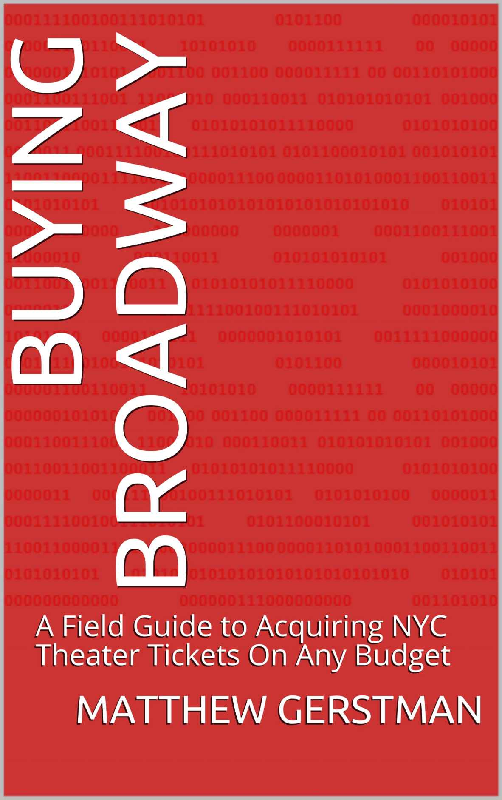

export { default as theme } from "./src/theme";
import AboutMe from "./src/about-me";
import { Appear, Image, Notes } from "mdx-deck";
import { CodeSurfer } from "mdx-deck-code-surfer";
import TallImage from "./src/tall-image";
import { TwitterTweetEmbed } from "react-twitter-embed";
import { AppearList } from "./src/appear-list";
import { NotesList } from "./src/notes-list";
import Emoji, { EmojiWrapper } from "./src/emoji";

# TypeScript: Seeing Past The Hype

---

<AboutMe />

---

<TallImage src="assets/me/love-taylor-swift.gif" />

---

<TallImage src="assets/me/taylor-swift-alone.gif" />

---

<TallImage src="assets/me/potter-puppet-pals.gif" />

---

<TallImage src="assets/me/potter-angst.gif" />

---

  

  

    bit.ly/broadway-book
  

---

# Thank you for indulging me

---

# Typescript

---

<TwitterTweetEmbed tweetId="1081778805956476928" />

---

<TwitterTweetEmbed tweetId="1081686244399214595" />

---

<TwitterTweetEmbed tweetId="1085844393549094912" />

---

<TwitterTweetEmbed tweetId="1079296773087285249" />

---

<TwitterTweetEmbed tweetId="1089069531513802755" />

---

  
  
  
  

---

## Google Trend

---

<TwitterTweetEmbed tweetId="1130516465520500736" />

---

# Today We're Going To Get Past The Hype

---

<TallImage src="assets/hype.gif" />

---

<TallImage src="assets/thoughtful.gif" />

---

# We're gonna go into the ugly parts, and then talk about why it's worth it anyway.

<NotesList>
  <li>I like to show the bad, and then show the good</li>
  <li>Dropbox is using TypeScript at scale</li>
</NotesList>

---

# Let's take 10 steps back

---

# What is a type?

---

# A type is an attribute of data that tells the computer how the programmer intends to use it.

---

# Basic Types

<AppearList>
  <li>
    <Emoji name="typescript.jpg" /> boolean
  </li>
  <li>
    <Emoji name="typescript.jpg" /> number
  </li>
  <li>
    <Emoji name="typescript.jpg" /> string
  </li>
  <li>
    <Emoji name="typescript.jpg" /> array
  </li>
  <li>
    <Emoji name="typescript.jpg" /> object
  </li>
</AppearList>

---

# Falsy Types

<AppearList>
  <li>
    <EmojiWrapper>❌</EmojiWrapper> null
  </li>
  <li>
    <EmojiWrapper>❌</EmojiWrapper> undefined
  </li>
  <li>
    <EmojiWrapper>❌</EmojiWrapper> never
  </li>
  <li>
    <EmojiWrapper>❌</EmojiWrapper> void
  </li>
</AppearList>

---

# Types can also be derived from other types

---

# Any

---

<TallImage src="assets/trust-me.gif" />

---

# What is TypeScript?

---

# Strict superset of JavaScript

---

<CodeSurfer
  code={require("!raw-loader!./snippets/what-is.ts").default}
  lang="typescript"
  showNumbers={true}
  dark={true}
  steps={[
    {},
    { tokens: { 1: [2, 3, 4, 5], 2: [3, 4, 5], 4: [6, 7, 8] } },
    { range: [4, 6] },
    { tokens: { 4: [5, 6, 7, 8] } },
    { lines: [1, 8] },
    { lines: [2, 9] },
  ]}
/>

---

## It's smart, really smart.

---

<CodeSurfer
  code={require("!raw-loader!./snippets/get-element.ts").default}
  lang="typescript"
  showNumbers={false}
  dark={true}
  steps={[
    {},
    {
      tokens: { 3: [6], 7: [6], 11: [6] },
    },
    {
      tokens: { 3: [8], 7: [8], 11: [8] },
    },
    {
      tokens: { 2: [0], 6: [0], 10: [0] },
    },
  ]}
/>

---

# It makes big refactors easy

---

# Demo: VSCode + Typescript

<NotesList>
  <li>Slytherins</li>
  <li>Autocomplete</li>
  <li>Object issues</li>
  <li>Slytherins hard to read error message</li>
</NotesList>

---

# TypeScript is going to get in your way for the first few months

---

# lodash.get/set

<Notes>Theres virtually no way to make this typesafe.</Notes>

---

# Tests require very well mocked data or lots of anys

---

# Advanced JavaScript translates to advanced TypeScript

---

# Higher Order Components

---

<TallImage src="assets/hoc.svg" />

---

<TallImage src="assets/inner-component.svg" />

---

# This is hard to type

<AppearList>
  <li>
    <Emoji name="typescript.jpg" /> Generics
  </li>
  <li>
    <Emoji name="typescript.jpg" /> Intersections
  </li>
  <li>
    <Emoji name="typescript.jpg" /> Discriminated Unions
  </li>
</AppearList>

---

<TallImage src="/assets/confused.gif" />

---

# Blogpost:

  bit.ly/ts-hoc

<Notes>It took me two weeks in 2017 to figure out how to type this.</Notes>

---

# TypeScript is not Sound!

<Notes>
  TypeScript’s type system allows certain operations that can’t be known at
  compile-time to be safe. When a type system has this property, it is said to
  not be “sound”.
</Notes>

---

# Anyone can put an <i>any</i> in your codebase.

<Notes>
  Remember how I said any means trust me?
</Notes>
---

<TallImage src="assets/trust-me-bad.gif" />

---

# React Context

---

<TallImage src="/assets/context.svg" />

---

<TallImage src="/assets/context-types.svg" />
<Notes>
We can peg a type to each component but there's no way to garauntee that they're actually compatible.
</Notes>

---

# React-Redux

---

# Context

---

# Thunks

---

# Dispatch

---

# TypeScript is a strict superset of JavaScript

---

# We're bolting on types to an untyped language

---

<CodeSurfer
  code={require("!raw-loader!./snippets/valid.js").default}
  lang="typescript"
  showNumbers={false}
  dark={true}
  title="Valid JavaScript"
  steps={[
    {},
    { range: [2, 4] },
    { range: [6, 8] },
    { range: [10, 12] },
    { lines: [14] },
    {},
  ]}
/>

---

# All of this is still worth it.

---

# TypeScript is just another tool

---

# TypeScript is not a silver bullet

---

# TypeScript eliminates a class of bugs

---

# undefined is not an object

---

# variable is not a function

---

# Changing Interfaces

<Notes>
  You saw this before with the Slytherins If someone adds a required prop to a
  component it'll catch it
</Notes>

---

# Dropbox Scale

<AppearList>
  <li>👩‍💻 Hundreds of engineers working on the same codebase</li>
  <li>📚 Millions of lines of Typescript</li>
  <li>📘 Hundreds of Features</li>
  <li>🌎 NY, SEA, SF, TLV</li>
</AppearList>

---

# Typescript is a core part of our frontend workflow

---

# Library Upgrades

---

# DefinitelyTyped

---

# The first thing we do when upgrading a library is swap out the types.

---

# TypeScript catches the vast majority of breakages when upgrading a library.

---

# Examples

<AppearList>
  <li>
    <EmojiWrapper>❌</EmojiWrapper> Deprecated features
  </li>
  <li>
    <EmojiWrapper>🔄</EmojiWrapper> Changed types
  </li>
  <li>
    <EmojiWrapper>✅</EmojiWrapper> The types often just get better
  </li>
</AppearList>

---

# At our scale I don't know how we would upgrade libraries without TypeScript

<Notes>
  MILLIONS of lines
</Notes>
---

# TypeScript allows us to place constraints on engineers.

---

# Problem

---

# We want to test React 16.8 in production.

---

# Developers will start using hooks as soon as we let them.

---

<TallImage src="assets/stampede.gif" />

---

# Solution

---

# Roll out React 16.8 behind a feature gate.

---

# Keep 16.7 React Types.

---

# When we're confident it works, add the types.

<NotesList>
  <li>
    Code changes so rapidly at Dropbox we have to garauntee a rollback is
    possible.
  </li>
  <li>The reason we do this is so we can make rollbacks easy.</li>
</NotesList>

---

<CodeSurfer
  title="Restrict Lodash Usage"
  code={require('!raw-loader!./snippets/lodash.ts').default}
  lang="javascript"
  showNumbers={false}
  dark={true}
/>
<Notes>We have a custom lodash build and we use types to enforce what functions can/can't be called</Notes>
---

# Blogpost:

  bit.ly/db-lodash

---

# What about for small teams?

<Notes>
All of this is great, but what about small teams.
</Notes>
---

# Free Documentation

---

# <s>Free Documentation</s>

---

# Free Tests

---

# <s>Free Tests</s>

---

# Contract Validation

---

# A Contract is precise and verifiable interface for software components.

<Notes>most important part is verifiable</Notes>

---

# Verifiable

---

# Api

<Notes>Types auto generated via stone</Notes>

---

# Component Library

<Notes>
  Types generated at build time so when we upgrade Dropbox.com we already know
  whats going to break
</Notes>

---

# Feature

<Notes>In between, we can develop the feature on it's own</Notes>

---

<CodeSurfer
  title="Sample App"
  code={require("!raw-loader!./snippets/sample-app.tsx").default}
  lang="javascript"
  showNumbers={false}
  dark={true}
  steps={[
    {},
    // Api
    { range: [0, 6] },
    { range: [1, 5] },
    { lines: [6] },
    // Redux - Action
    { range: [8, 13] },
    { range: [9, 12] },
    { lines: [11] },
    { lines: [13] },
    // Redux - Selector
    { range: [15, 20] },
    { range: [15, 19] },
    { lines: [17] },
    { lines: [20] },
    // View
    { range: [22, 29] },
    { range: [22, 25] },
    { range: [26, 29] },
    // Return to types
    { range: [1, 5] },
    { lines: [20] },
    { range: [26, 29] },
  ]}
/>

---

# TypeScript increases in value over time

---

<TallImage src="/assets/loc-time.png" />

---

<Notes>
<li>Remember all the parts of your system</li>
<li>Maybe your test coverage doesnt catch this</li>
</Notes>

---

# Unlike tests, typescript gets in your way

---

# TypeScript is not a silver bullet!

<AppearList>
  <li>
    <EmojiWrapper>👩🏽‍🔬</EmojiWrapper> You still need to write tests
  </li>
  <li>
    <EmojiWrapper>👩‍💻</EmojiWrapper> You still need to review code
  </li>
  <li>
    <EmojiWrapper>👩🏾‍🏫</EmojiWrapper> You still need to think about architecture
  </li>
</AppearList>

---

# The metric for success on a codebase is how few things you need to keep in your head at a time.

---

# TypeScript allows you to forget about other parts of your codebase

---

# The cost of TypeScript is learning it.

---

# References

  <ul style={{fontSize: 24}}>
    <li><Emoji size="20px" name="typescript.jpg" /><a href="https://en.wikipedia.org/wiki/Data_type">https://en.wikipedia.org/wiki/Data_type</a></li>
    <li>
      <Emoji size="20px" name="typescript.jpg" /><a href="https://blogs.dropbox.com/tech/2018/09/migrating-from-underscore-to-lodash">https://blogs.dropbox.com/tech/2018/09/migrating-from-underscore-to-lodash/</a></li>
    <li><Emoji size="20px" name="typescript.jpg" /><a href="https://twitter.com/MatthewGerstman/status/1087928519592722432?s=20">https://twitter.com/MatthewGerstman/status/1087928519592722432?s=20</a></li>
    <li><Emoji size="20px" name="typescript.jpg" /><a href="https://news.ycombinator.com/item?id=18975373">https://news.ycombinator.com/item?id=18975373</a></li>
    <li><Emoji size="20px" name="typescript.jpg" /><a href="https://medium.com/javascript-scene/the-typescript-tax-132ff4cb175b">https://medium.com/javascript-scene/the-typescript-tax-132ff4cb175b</a></li>
    <li><Emoji size="20px" name="typescript.jpg" /><a href="https://en.wikipedia.org/wiki/Design_by_contract">https://en.wikipedia.org/wiki/Design_by_contract</a></li>
    <li><Emoji size="20px" name="typescript.jpg" /><a href="https://medium.com/@jasvir/monoglots-when-a-subset-is-not-1604e3a51d9">https://medium.com/@jasvir/monoglots-when-a-subset-is-not-1604e3a51d9</a></li>
  </ul>

---

# Thank You!

---

<AboutMe />
