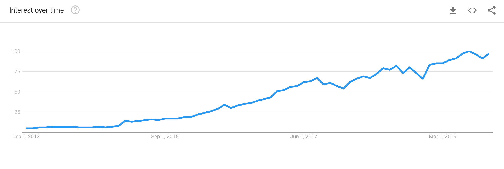

export {default as theme} from './src/theme';
import AboutMe from './src/about-me';
import {Appear, Image, Notes} from 'mdx-deck';
import {CodeSurfer} from 'mdx-deck-code-surfer';
import TallImage from './src/tall-image';
import {TwitterTweetEmbed} from 'react-twitter-embed';
import {AppearList} from './src/appear-list';
import {NotesList} from './src/notes-list';

# TypeScript: Seeing Past The Hype

---

<AboutMe />

---

<TwitterTweetEmbed tweetId="1081778805956476928" />

---

<TwitterTweetEmbed tweetId="1081686244399214595" />

---

<TwitterTweetEmbed tweetId="1085844393549094912" />

---

<TwitterTweetEmbed tweetId="1079296773087285249" />

---

<TwitterTweetEmbed tweetId="1089069531513802755" />

---

  
  
  
  

---

## Google Trend

---

# Today We're Going To Get Past The Hype

---

# We're gonna go into the ugly parts, and then talk about why it's worth it anyway.

<NotesList>
  <li>I like to show the bad, and then show the good</li>
  <li>Dropbox is using TypeScript at scale</li>
</NotesList>

---

# Let's take 10 steps back

---

# What is a type?

---

# A type is an attribute of data that tells the computer how the programmer intends to use it.

---

# Basic Types

<AppearList>
  <li>boolean</li>
  <li>number</li>
  <li>string</li>
  <li>array</li>
  <li>object</li>
</AppearList>

---

# Falsey Types

<AppearList>
  <li>null</li>
  <li>undefined</li>
  <li>never</li>
  <li>void</li>
</AppearList>

---

# Types can also be derived from other types

---

# Any

---

# What is TypeScript?

---

# Strict superset of JavaScript

---

<CodeSurfer
  code={require('!raw-loader!./snippets/what-is.ts').default}
  lang="typescript"
  showNumbers={true}
  dark={true}
  steps={[
    {},
    {tokens: {1: [2, 3, 4, 5], 2: [3, 4, 5], 4: [6, 7, 8]}},
    {lines: [1, 8]},
    {lines: [2, 9]},
  ]}
/>

---

## It's smart, really smart.

---

<CodeSurfer
  code={require('!raw-loader!./snippets/get-element.ts').default}
  lang="typescript"
  showNumbers={false}
  dark={true}
  steps={[
    {},
    {
      tokens: {3: [6], 7: [6], 11: [6]  }
    },
    {
      tokens: {3: [8], 7: [8], 11: [8]},
    },
    {
      tokens: {2: [0], 6: [0], 10: [0]},
    },
  ]}
/>

---

# It makes big refactors easy

---

# Demo: VSCode + Typescript
<NotesList>
  <li>Slytherins</li>
  <li>Autocomplete</li>
  <li>Object issues</li>
  <li>Slytherins hard to read error message</li>
</NotesList>

---

# TypeScript is going to get in your way for the first few months

---

# lodash.get/set
<Notes>
  Theres virtually no way to make this typesafe.
</Notes>

---

# Tests require very well mocked data or lots of anys

---

# Advanced JavaScript translates to advanced TypeScript

---

# Higher Order Components

---

<TallImage src="assets/hoc.svg" />

---

<TallImage src="assets/inner-component.svg" />

---
# This is hard to type

<AppearList>
  <li>Generics</li>
  <li>Intersections</li>
  <li>Discriminated Unions</li>
</AppearList>

---

<TallImage src="/assets/confused.gif" />

---

# Blogpost:
# <a href="http://bit.ly/ts-hoc">bit.ly/ts-hoc</a>

<Notes>
It took me two weeks in 2017 to figure out how to type this.
</Notes>

---

# We're bolting on types to an untyped language

---

<CodeSurfer
  code={require('!raw-loader!./snippets/valid.js').default}
  lang="typescript"
  showNumbers={false}
  dark={true}
  title="Valid JavaScript"
  steps={[
    {},
  ]}
/>

---

# It's another build tool!
<NotesList>
  <li>This is another thing you have to learn to config</li>
  <li>This is another thing you have to maintain</li>
  <li>This is another thing you have to upgrade</li>
</NotesList>

---

# All of this is still worth it.

---

# Dropbox Scale

<AppearList>
  <li>👩‍💻 Hundreds of engineers working on the same codebase</li>
  <li>📚 Millions of lines of Typescript</li>
  <li>📘 Hundreds of Features</li>
  <li>🌎 NY, SEA, SF, TLV</li>
</AppearList>

---

# Typescript is a core part of our frontend workflow

---

# Library Upgrades

---

# TypeScript catches the vast majority of breakages when upgrading a library.

---

# Examples
<AppearList>
  <li>Deprecated features</li>
  <li>Changed types</li>
  <li>The types often just get better</li>
</AppearList>

---

# At our scale I don't know how we would upgrade libraries without TypeScript
<Notes>
  MILLIONS of lines
</Notes>
---

# TypeScript allows us to place constraints on engineers.

---

# Problem

---

# We want to test React 16.8 in production.

---

# Developers will start using hooks as soon as we let them.
---

<TallImage src="assets/stampede.gif" />

---

# Solution

---

# Roll out React 16.8 behind a feature gate.

---

# Without upgrading the React Types, developers can't use the feature.

---

# When we're confident it works, add the types.

---

<CodeSurfer
  title="Restrict Lodash Usage"
  code={require('!raw-loader!./snippets/lodash.ts').default}
  lang="javascript"
  showNumbers={false}
  dark={true}
  steps={[
    {}
  ]} />
<Notes>We have a custom lodash build and we use types to enforce what functions can/can't be called</Notes>

---

# What about for small teams?
<Notes>
All of this is great, but what about small teams.
</Notes>
---

# Free Documentation

---

# <s>Free Documentation</s>

---

# Free Tests

---

# <s>Free Tests</s>

---

# Contract Validation

---

# Contract

<Notes>Contract definition</Notes>

---

# Api

<Notes>Types auto generated via stone</Notes>

---

# Component Library

<Notes>
  Types generated at build time so when we upgrade Dropbox.com we already know
  whats going to break
</Notes>

---

# Feature

<Notes>In between, we can develop the feature on it's own</Notes>

---

<CodeSurfer
  title="Sample App"
  code={require('!raw-loader!./snippets/sample-app.tsx').default}
  lang="javascript"
  showNumbers={false}
  dark={true}
  steps={[
    {},
    // Api
    {range: [0, 6]},
    {range: [1, 5]},
    {lines: [6]},
    // Redux - Action
    {range: [8, 13]},
    {range: [9, 12]},
    {lines: [11]},
    {lines: [13]},
    // Redux - Selector
    {range: [15, 25]},
    {range: [15, 19]},
    {lines: [17]},
    {lines: [20]},
    // View
    {range: [22, 29]},
    {range: [22, 25]},
    {range: [26, 29]},
    // Return to types
    {range: [1, 5]},
    {lines: [20]},
  ]}
/>

---

# TypeScript increases in value over time

---

<TallImage src="/assets/loc-time.png" />

---

<Notes>
<li>Remember all the parts of your system</li>
<li>Maybe your test coverage doesnt catch this</li>
</Notes>

---

# TypeScript is not a silver bullet!
<AppearList>
  <li>You still need to write tests</li>
  <li>You still need to review code</li>
  <li>You still need to think about architecture</li>
</AppearList>

---

# Unlike tests, typescript gets in your way

---

# The metric for success on a codebase is how many things you need to remember at once.

---

# TypeScript allows you to forget about other parts of your codebase

---

# The cost of TypeScript is learning it.

---

References

<ul>
  <li>https://en.wikipedia.org/wiki/Data_type</li>
  <li>https://blogs.dropbox.com/tech/2018/09/migrating-from-underscore-to-lodash/</li>
  <li>https://twitter.com/MatthewGerstman/status/1087928519592722432?s=20</li>
  <li>https://news.ycombinator.com/item?id=18975373</li>
  <li>https://medium.com/javascript-scene/the-typescript-tax-132ff4cb175b</li>
</ul>

---

# Thank You!

---

<AboutMe />
